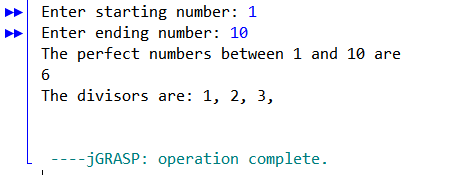
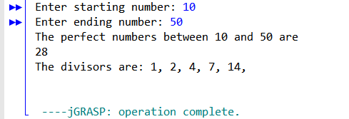

# Perfect Number
In number theory, a perfect number is a positive integer that equals to the sum of its positive factors, excluding the number itself.
For instance, 6 has factors 1, 2 and 3 (excluding itself), so 1 + 2 + 3 = 6, so 6 is a perfect number.

This C++ program can find a perfect number between any set of numbers. Enter a min (starting value) and max (ending value) to define the limits of your number set. Then the programs runs an algorthim to loop through all the numbers in the set to find the perfect number.

<b> Example: </b>

 

 

